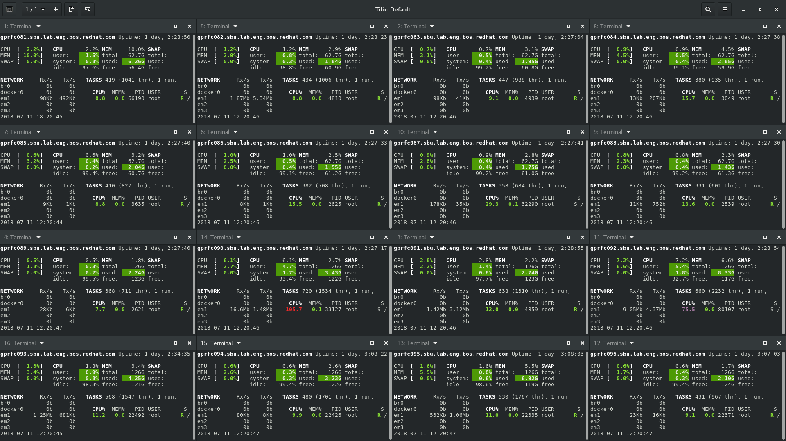

# Tilix matrix

The `tilix-matrix` script allows to run a command on all cluster nodes
(simulation and IoT) at the same time in a single
[Tilix](https://github.com/gnunn1/tilix) window.

The first argument to the `tilix-matrix` script is passed in as command to
the remote SSH call.

**Note:** It only makes sense to use this tool for applications which require
console interaction. Otherwise use something like Ansible or `pssh? .

## Examples

Execute `glances` on all cluster machines:

    ./tilix-matrix glances

Execute `sleep 5` on all remote machines:

    ./tilix-matrix "sleep 5"

## Screenshot

